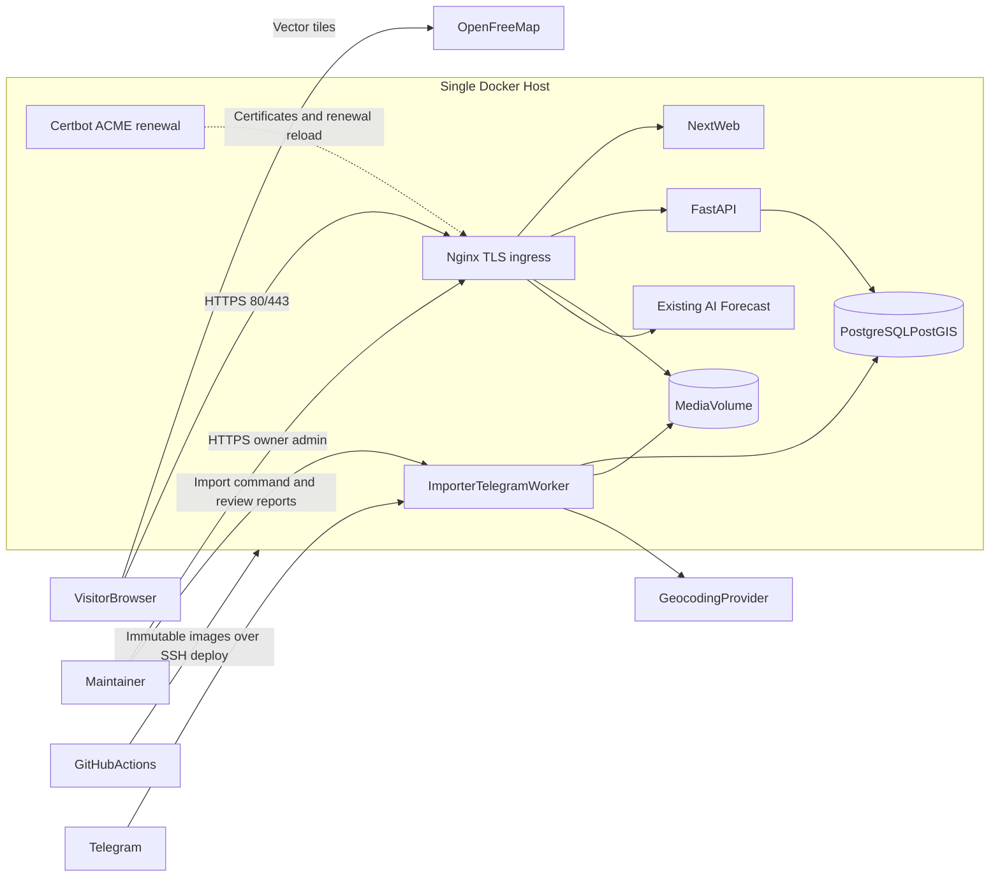
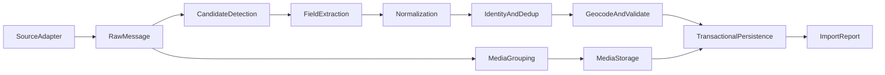

# Architecture

## Architecture goals

- Deliver the complete MVP on one modest Linux server for fewer than 10,000 users.
- Keep domain decisions, authorization, filtering, grouping, masking, and display projections authoritative in the backend; the frontend primarily renders and localizes returned data.
- Keep parsing, geocoding, and Telegram source logic outside request handlers.
- Make every historical and live ingestion operation replayable and traceable.
- Keep map, geocoder, media, and hosting providers replaceable.
- Apply SOLID/DRY with explicit boundaries, interactors, presenters, domain/application services, ports, and adapters without generic framework abstractions.
- Scale vertically first and add infrastructure only when measured limits justify it.

## System context



OpenFreeMap, Geoapify, Telegram, and GitHub are external dependencies, not containers owned by this project. All project-owned runtime processes are containerized. [E7-T8](../epics/E7-production-delivery/tasks/E7-T8-build-shared-nginx-tls-ingress.md), [E7-T9](../epics/E7-production-delivery/tasks/E7-T9-implement-reversible-shared-edge-cutover.md), and [E7-T10](../epics/E7-production-delivery/tasks/E7-T10-roll-out-and-verify-shared-tls.md) delivered the live shared Nginx/Certbot edge; [E7-T7](../epics/E7-production-delivery/tasks/E7-T7-enable-production-registration-and-contact-reveal.md) enabled production authentication, administration, and contact reveal on that HTTPS origin. The application-owned Caddy listener remains on port 3100 for local use and production rollback, not as the public entry point.

## Technology stack

### Web application

- TypeScript in strict mode.
- Next.js App Router and React.
- MapLibre GL JS through the MapLibre entry point provided by `react-map-gl`.
- TanStack Query for server-state fetching, cancellation, caching, and error handling.
- `openapi-typescript` and `openapi-fetch` for generated API contracts rather than handwritten domain/API types.
- `next-intl` with English keys for interface copy and locale-aware display formatting.
- URL search parameters as the source of truth for user-selected filters.
- Tailwind CSS with accessible Radix primitives and selectively generated shadcn components.
- Zod/React Hook Form for immediate form usability; backend validation remains authoritative.

Avoid a global client-state library initially. Local component state, URL state, and TanStack Query cover the MVP.

The map is a client component loaded only in the browser. The route shell, metadata, and accessible non-map structure can render on the server.

### API and ingestion

- Python with type checking enabled.
- FastAPI and Pydantic for validated HTTP contracts and OpenAPI.
- FastAPI Users with SQLAlchemy as an evaluated foundation for username/password registration and database-backed cookie sessions; the spike replaces it if adapting email-oriented defaults is not worthwhile.
- Starlette Admin for the HTTPS-only owner console, with project-owned auth, CSRF, permissions, interactors, and audit.
- SQLAlchemy 2 for persistence and explicit transactions.
- Alembic for forward-only schema migrations.
- `asyncpg` as the PostgreSQL driver.
- `ijson` for streaming the historical export rather than loading the whole document into memory.
- `httpx` for controlled external HTTP calls.
- Telethon in the long-running Telegram worker and bounded backfill command.
- Structlog configured for structured JSON in production.

Durable imports, media work, and Telegram updates do not run as FastAPI background tasks. They use a separate process/container so API restarts do not lose jobs.

### Data and edge

- PostgreSQL with PostGIS for spatial predicates and indexes.
- Nginx for live public TLS, routing, compression, security headers, and local media delivery; Certbot for free Let's Encrypt issuance/renewal. Caddy remains the local same-origin edge and production rollback listener.
- A mounted media volume for the MVP.
- OpenFreeMap vector styles/tiles, configured through environment values.

Redis, a task queue, Elasticsearch, Kubernetes, and a service mesh are intentionally absent.

## Repository shape

```text
AI/
  README.md
  product/
    README.md
    SCOPE.md
    EXPERIENCE.md
    QUALITY.md
  data/
    README.md
    SOURCE_BASELINE.md
    QUALITY_AND_READINESS.md
  contracts/
    README.md
    DATA_MODEL.md
    HTTP_API.md
    OPENAPI.md
  architecture/
    README.md
    SYSTEM.md
    DEPENDENCY_BASELINE.md
  ingestion/
    README.md
    PIPELINE.md
    GEOCODING.md
  security/
    README.md
    AUTH_ADMIN_CONTACTS.md
  operations/
    README.md
    DEPLOYMENT.md
    SERVER.md
  governance/
    README.md
    REPOSITORY_RULES.md
  decisions/
    README.md
    adr/
    deferred/
  milestones/
    README.md
  epics/
    README.md
    E*-*/
      README.md
      SPIKE.md
      IMPLEMENTATION_PLAN.md
      proposed-tasks/
      tasks/                 # created only by valid task promotion
  workflow/
    README.md
    DEFINITION_OF_DONE.md
    templates/
contracts/
  openapi/
    v1.json
apps/
  web/
    src/
    e2e/
  backend/
    src/wef_backend/
      features/
        admin/
        catalog/
        contacts/
        estates/
        identity/
        ingestion/
    alembic/
    tests/
infra/
  compose.yaml
  compose.production.yaml
  compose.production-shared-edge.yaml
  compose.shared-edge.yaml
  Caddyfile.production  # application rollback listener
  nginx/                # live shared-edge configuration
tests/
  fixtures/  # shared synthetic/redacted cross-application fixtures only
.github/
  workflows/
```

Backend code is a package-by-feature modular monolith. Each feature follows the inward dependency rule `interface -> application -> domain`; infrastructure implements inward-owned ports and is wired only in the composition root. `import-linter` enforces layer, feature-independence, forbidden-import, and acyclic contracts.

Interactors own use-case orchestration and mutation transaction boundaries. Query services own backend-computed read projections. Domain/application services hold reusable rules. Presenters map application output DTOs to versioned Pydantic responses and perform no I/O or authorization. Route handlers remain transport adapters and do not contain business logic.

The API, historical importer, and Telegram listener share feature/domain/application modules but start with different commands from the same backend image. Detailed boundaries, dependencies, examples, and the required proof are in the [Epic 0 architecture/dependency spike](../epics/E0-architecture-dependency-spike/SPIKE.md).

## Runtime components

### Nginx and Certbot

- Nginx is the live public web server and TLS reverse proxy on ports 80/443; the application Caddy edge remains reachable on configurable port 3100 only as a rollback/diagnostic path.
- Routes the WEF hostname to private WEF upstreams. AI Forecast remains outside this edge on its existing public port `3000`; the renderer retains an optional future Forecast-vhost mode.
- Certbot obtains free Let's Encrypt certificates, persists its complete state, renews unattended, and gracefully reloads Nginx only after successful renewal.
- Routes `/api/*` to FastAPI.
- Routes application requests to Next.js.
- Serves `/media/*` from a read-only volume using generated storage keys.
- Adds conservative security headers.
- Exposes no application, database, or worker upstream port publicly after cutover.
- Keeps shared-ingress deploy/rollback independent of ordinary WEF application releases.

### Next.js web

- Delivers the route shell and frontend assets.
- Calls the same-origin `/api/v1` endpoints.
- Renders/localizes backend-computed projections and capabilities; it does not duplicate filter, grouping, visibility, masking, source-link, or authorization rules.
- Requests vector tiles directly from the configured style provider.
- Does not receive database credentials, storage paths, Telegram credentials, or private geocoder keys.
- Treats every `NEXT_PUBLIC_*` value as public by definition.

### FastAPI

- Provides public, read-only map/filter/detail endpoints.
- Provides same-origin account/session endpoints and the authenticated contact-reveal mutation.
- Validates query ranges, bounding boxes, and pagination.
- Routes invoke one application query/interactor and present its output; routes do not contain domain logic or persistence.
- Returns compact location summaries for maps and separate detail payloads.
- Generates OpenAPI used to verify or generate frontend types.
- Exposes liveness and readiness endpoints.
- Does not parse raw Telegram exports or download media inside web requests.
- Masks contacts in every anonymous response; plaintext contact decryption exists only in the authorized no-store reveal path.
- Generates the canonical OpenAPI contract offline, while production disables `openapi_url`, Swagger UI, and ReDoc routes.

The committed schema, frontend generation, static Redocly CI artifact, breaking-change checks, and production 404 requirements are defined in the [OpenAPI contract](../contracts/OPENAPI.md).

### Owner admin console

- Starlette Admin renders owner-only server-side pages under `/admin` after HTTPS.
- Its custom authentication provider delegates to the identity application service.
- User/session/password-reset/reveal-audit actions call owner-authorized interactors and write `AdminAuditEvent`; model views do not write sensitive tables directly.
- Admin HTML/actions are outside public OpenAPI and require explicit secure-cookie, CSRF/origin, rate-limit, no-store, and authorization tests.
- The Locations page (`/admin/places`, E18) lists every canonical location with review-status filters and address search, and resolves points through owner-authorized interactors: manual placement on a dependency-free map picker (offer evidence beside the map, OSM raster tiles fetched by the owner's browser from a full-page route served with a console-owned static script), candidate acceptance, rejection, and unresolve. Each decision appends a `location_geocode_selections` lineage row plus an admin audit event; manual points store `precision=building`, `confidence=1.00`, and are validated against the Warsaw scope.

### Importer/Telegram worker

- Runs the staged `wef-import` commands `dry-run`, `persist`, `geocode`, `media`, `verify`, and `run`, plus the aggregate `wef-importer-dry-run` audit command.
- Runs `wef-telegram-backfill`, the single long-lived `wef-telegram-worker`, and the redacted `wef-telegram-worker-status`/rotation/liveness checks.
- Acquires a PostgreSQL advisory lock per channel/import mode to prevent duplicate concurrent processors.
- Persists checkpoints and ingestion runs.
- Uses bounded concurrency for media and provider calls.
- Exits non-zero on an incomplete one-off run.

### PostgreSQL/PostGIS

- Is the canonical source for public application data.
- Uses normal relational fields for filterable values and PostGIS points for locations.
- Uses a GiST spatial index plus selective B-tree indexes defined in the [data model](../contracts/DATA_MODEL.md).
- Is reachable only on the Compose network.

### Media storage

- The storage interface accepts a stream and returns an opaque key, checksum, byte count, detected MIME type, and dimensions/duration where available.
- The local implementation writes atomically to a mounted volume.
- Database rows store keys such as checksum-derived paths, never absolute host paths.
- The application media-edge container receives only the public-derivative subtree read-only; shared Nginx reaches it through the private `wef-edge` network, while the Caddy rollback route uses the same bounded public-media path.
- A future S3 implementation can preserve public API URL semantics.

## Main request flow

1. The browser opens the live HTTPS page through shared Nginx; local development and production rollback use Caddy.
2. Next.js returns the route shell; the client-only map initializes MapLibre.
3. MapLibre loads the configured OpenFreeMap style and tiles with required attribution.
4. The client parses filters from the URL and requests `/api/v1/map/locations` with the viewport bounding box.
5. FastAPI validates the request, executes spatial/filter queries, and returns compact GeoJSON.
6. MapLibre clusters and renders points client-side.
7. Selecting a point requests `/api/v1/locations/{id}/offers` for related offers and `/api/v1/offers/{id}` for full detail.
8. Media loads from same-origin opaque `/media/` URLs.

For the expected few hundred locations, client-side MapLibre clustering is simpler and sufficient. Server-side tile generation is a later scale option, not an MVP requirement.

## Ingestion flow



Source adapters are replaceable. Every stage records parser/rule versions and reason codes so a new parser can reprocess saved raw messages without redownloading Telegram history.

## Configuration

Configuration is validated at process startup.

Categories include:

- Public: site URL, map style URL, default center/bounds, displayed attribution.
- Shared private: database URL and media root.
- Auth private: public/admin session secrets, contact encryption/HMAC keys, allowed origin, and one-time owner bootstrap credentials.
- Import private: geocoder credentials/contact identity and source paths.
- Telegram private: API ID, API hash, session string, and configured channel entity.
- Deployment private: registry pull credentials and SSH deployment material.

GitHub Actions variables/secrets are the deployment source of truth. Every deployment transfers a complete configuration to an atomic mode-0600 release directory on the server; no value is committed or printed, and no default secret is accepted in production.

## Reliability and observability

- `/api/v1/health/live` confirms the API process is running.
- `/api/v1/health/ready` checks required database connectivity and migration compatibility.
- Compose health checks gate dependent services.
- Logs include timestamp, level, service, environment, release SHA, request/run ID, and event name.
- API access logs exclude query values that could contain source text or contact data.
- Import metrics are persisted in `ingest_runs` and its report artifact.
- External calls use explicit connect/read timeouts, bounded retries with jitter, and provider-specific rate limits.
- An external uptime check is recommended after the server is supplied.

No dedicated metrics stack is required initially. Add one when logs and host-level monitoring cannot answer operational questions.

## Security boundaries

- The live WEF application is public on 80/443 through shared Nginx. SSH, AI Forecast on `:3000`, and the retained WEF Caddy rollback listener on `:3100` follow the documented host/firewall boundary.
- PostgreSQL and worker processes have no public ports.
- Containers run as non-root where their base image permits.
- Images use pinned runtime versions, minimal production stages, and read-only filesystems where practical.
- Uploaded/source media is not executable and is served with detected content types plus `X-Content-Type-Options: nosniff`.
- API query values are parameterized through SQLAlchemy.
- CORS is unnecessary when the web and API are same-origin.
- The API applies bounded public-route and identity/reveal rate limits; shared Nginx adds edge protections and security headers without replacing backend authorization limits.

## Test strategy

- Backend unit tests: parser rules, normalization, deduplication, filter semantics, and link construction with pytest.
- Backend integration tests: PostgreSQL/PostGIS queries and migrations against an ephemeral container.
- Architecture tests: `import-linter` enforces inward layers, feature independence, forbidden framework imports, and acyclic modules.
- Application tests invoke interactors/query services with fakes at narrow ports; presenter tests verify serialization independently.
- Frontend unit/component tests: filter serialization, result states, and accessible controls with Vitest and Testing Library.
- End-to-end tests: map/list/detail critical path with Playwright using deterministic API fixtures.
- Contract check: generated OpenAPI must match checked/generated TypeScript client types.
- Import golden tests: synthetic Telegram fixtures produce versioned expected records and reconciled counts.

## Scale boundaries and triggers

Remain on this topology while:

- The database and media fit comfortably on one host with disk headroom.
- API latency meets the target.
- A deploy restart is acceptable.
- The Telegram worker can keep pace with one channel.

Revisit architecture when measured conditions show:

- Map payloads become large enough to require server-side vector tiles.
- Database reads need a replica or connection pooler.
- Media bandwidth or disk pressure favors object storage and a CDN.
- Multiple ingestion channels or expensive jobs require a durable queue.
- Availability requirements justify at least two application hosts.

These are triggers, not pre-approved dependencies.
