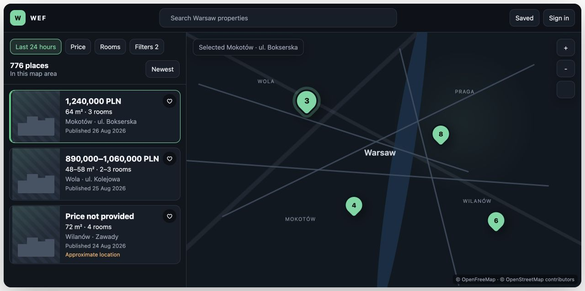
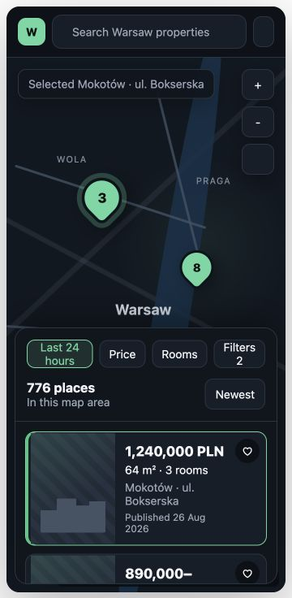

# E13 frontend improvement and interaction design

## Product direction

The redesign should feel like a focused map product, not a marketing page with
a map embedded below it. The map is the workspace. The listing rail is the
primary navigation surface. Filters support discovery without displacing the
results they control.

The reference to Google Maps means adopting its useful interaction model—not
copying its brand:

- one full-height application shell;
- persistent search/results beside a dominant map;
- compact controls layered near the content they affect;
- strong selected-item continuity between list and map;
- reversible drill-in navigation rather than long, appended sections.

## Visual references

These static mockups illustrate the proposed dark shell, compact filter row,
selectable result cards, coordinated pin state, and responsive mobile sheet.
They are design references rather than screenshots of implemented behavior.

### Desktop



### Mobile



## Desktop information architecture

```text
+--------------------------------------------------------------------------+
| WEF | Search Warsaw properties... | Filters | Saved | Account            |
+----------------------------+---------------------------------------------+
| 776 places in this area     |                                             |
| [Newest] [Price] [Rooms]    |                DARK MAP                     |
|                            |                                             |
| Listing/location card       |       grouped pins + district boundaries    |
| Listing/location card       |                                             |
| Listing/location card       |                         zoom / locate        |
| ...                         |                                             |
|                            |                            attribution       |
+----------------------------+---------------------------------------------+
```

- Application bar: 56–64 px, single line at ordinary desktop widths.
- Discovery rail: `clamp(22rem, 30vw, 26rem)` with its own scroll region.
- Map: fills all remaining width and application height.
- Filter chips: one horizontally wrapping row; the full filter form opens in a
  rail-width drawer or popover and does not permanently push results away.
- Results header: count, current scope (`Map area`), and sort. It remains sticky
  below search/filter controls.
- Cards: results begin immediately after the header.

## Mobile information architecture

- Full-bleed map beneath a compact top search bar.
- Bottom control announces the result count and opens a sheet.
- Sheet states: collapsed handle/count, half-height results, and full-height
  list. Existing explicit Full list and Show map actions remain available.
- Filters open as a full-height modal sheet with Apply and Clear actions sticky
  at the bottom.
- Selecting a listing returns to the map with the pin selected and leaves a
  compact selected-card sheet. Opening details uses the existing detail drawer
  semantics and deterministic focus restoration.

## Visual system

### Color tokens

All text/surface combinations must meet WCAG 2.2 AA and must be verified in the
rendered application.

| Token | Value (GitHub Dark, 2026-08-27) | Original value | Use |
| --- | --- | --- | --- |
| `--background` | `#0d1117` | `#080b10` | application canvas |
| `--surface` | `#161b22` | `#10151d` | rail, drawers, dialogs |
| `--surface-raised` | `#21262d` | `#171e28` | cards and floating controls |
| `--surface-hover` | `#262c36` | `#1d2632` | hover/focus-adjacent state |
| `--foreground` | `#e6edf3` | `#f4f7fb` | primary text |
| `--muted` | `#8b949e` | `#9ba8b8` | supporting text |
| `--border` | `#30363d` | `#293442` | structural separators |
| `--accent` | `#3fb950` | `#62d7a1` | primary selection/action |
| `--accent-strong` | `#238636` | `#22c77a` | selected pin/card edge and primary buttons |
| `--focus` | `#4493f8` | `#8ab4ff` | keyboard focus ring |
| `--warning` | `#d29922` | `#ffb86b` | approximate/low confidence |
| `--error` | `#f85149` | `#ff7f87` | errors only |

On 2026-08-27 the owner directed the shipped palette to match GitHub Dark
(Primer): canvas `#0d1117`, subtle `#161b22`, button surface `#21262d`,
border `#30363d`, text `#e6edf3`, muted `#8b949e`, green `#3fb950` /
`#238636`, blue `#4493f8`, attention `#d29922`, danger `#f85149`. Primary
buttons use white text on `#238636` (hover `#2ea043`); map overlays
(district tint/lines/labels, cluster circles, default and low-confidence
pins, selected/hover halos) follow the same mapping. All text/surface
combinations still meet WCAG 2.2 AA.

Large-area green is avoided. Accent color marks selection and primary actions;
it does not tint every panel.

### Typography and density

- Retain the system font stack to avoid a production dependency.
- App title: compact wordmark, not a large page headline.
- Rail title/result count: 1–1.125 rem, semibold.
- Card title: 0.95–1 rem, two-line clamp.
- Metadata: 0.75–0.875 rem with tabular numerals for prices/counts.
- Minimum pointer target: 44 × 44 px on coarse pointers.

### Elevation and shape

- Rail and map are separated by a 1 px border, not a large outer card.
- Cards use 10–12 px radius and a quiet raised surface. Avoid shadows inside a
  dense scrolling rail.
- Map controls may use one restrained shadow to remain legible over tiles.
- Selected card uses a 3 px accent inset edge plus `aria-selected=true`; selected
  state never relies on color alone.

## Rail states

### Results

Each offer card should show, when the backend provides sufficiently confident
values:

- thumbnail or stable no-media placeholder;
- price or price range;
- area and room count;
- development/location name and district/address;
- `Published <date>`;
- offer type/market when known;
- favorite action when signed in;
- low/partial confidence as labeled text, not an icon alone.

Cards must never use `Available`, `Active`, or equivalent language.

Until E13-T2 exists, the first slice uses grouped-location cards showing name,
address, confidence, and matching-offer count. It must label them as places or
locations, not listings.

### Selected location/listing

- Selecting a location card replaces the rail list with a selected-location
  header and its dated offers. It does not append offers after the full list.
- Selecting an offer card sets the parent location pin selected, recenters only
  when the pin is outside a comfortable map padding region, and keeps the map
  instance alive.
- A visible Back to results control restores the prior list scroll position and
  focus.
- Complete detail/media/contact content stays in the existing detail drawer.

### Loading and refresh

- First load: 4–6 rail skeleton rows with one map loading label.
- Viewport refresh: preserve prior cards, show a compact `Updating this area…`
  status, and replace only when the query settles.
- Do not blank the rail or reset scroll/focus for background map movement.

### Empty, API error, and degraded map

- Empty: keep search/filter controls and show `No results in this map area`
  with Clear filters and Reset map actions.
- API error: keep the last safe card collection when present; show Retry without
  rendering raw errors.
- Map unavailable: rail becomes the primary surface and remains fully usable.
- Tile/style failure: preserve map container size and all list/filter state.

## Filter design

- Search input occupies the app bar/rail top. It may initially be a labeled
  presentation slot if no text-search contract exists; do not ship a fake
  non-functional input.
- Always-visible chips: Price, Rooms, District, More filters.
- Applied chips show a concise value and a remove action with an accessible
  name.
- Quick filters remain backend-provided and appear in the same chip row.
- Full filter drawer reuses one draft state and the existing Apply/Clear URL
  lifecycle.
- Malformed backend facet values must not be silently title-cased or merged by
  the frontend. The UI may bound the list and provide search only after a
  backend/data normalization task is agreed.

## Map design

- Use a verified dark OpenFreeMap-compatible style with readable roads, water,
  parks, labels, and attribution.
- District fills are subtle; boundaries remain legible but subordinate to
  offer pins.
- Cluster: raised dark circle, accent border, high-contrast count.
- Default location: accent fill with dark stroke.
- Low-confidence location: warning fill plus accessible list text.
- Hover/focus location: outer focus halo.
- Selected location: larger accent halo and inner dark keyline.
- Map/list hover is enhancement only. Keyboard activation performs the same
  selection and detail actions.
- Remove the duplicate custom attribution; keep exactly one complete, visible
  attribution control.

## Interaction contract

| Event | Rail response | Map response | Focus/announcement |
| --- | --- | --- | --- |
| Hover/focus card | emphasize card | show hover halo | no noisy hover announcement |
| Activate card | mark selected; show selected view | select parent pin; conditionally recenter | announce selected name |
| Activate pin | select related place | selected halo | open/focus rail selected header on keyboard path |
| Change filters | preserve prior results while fetching | preserve map instance | announce result count once settled |
| Move map | show updating state after debounce | no remount | do not move focus |
| Back to results | restore list and scroll | retain selected halo until new selection | restore focus to prior card or list heading |
| Open detail | retain selected card snapshot | retain selected halo | detail owns focus; close restores trigger |

## Accessibility requirements

- Keep the semantic result list as the primary browsing mechanism; map canvas is
  never the only route to a result.
- Use one `main`, one map region, one complementary discovery rail, and one
  labeled results list.
- Cards use buttons or listbox/option semantics only when the complete keyboard
  model is implemented. Prefer list + button for the first slice.
- Visible focus, logical DOM order, deterministic focus restoration, reduced
  motion, live-region deduplication, non-color selected/confidence states, and
  200% zoom without lost actions are acceptance requirements.
- At 360 px, no horizontal scrolling and no control hidden behind browser safe
  areas.

## Performance requirements

- Do not render hundreds of full offer cards at once. The new contract must be
  paginated; render the current page plus a bounded prefetch.
- Do not request offers once per visible location.
- Do not remount MapLibre for theme, filter, hover, or selection changes.
- Thumbnails load lazily with explicit dimensions and stable placeholders.
- Preserve the current 300 ms viewport debounce unless measurement justifies a
  documented change.
- Target the existing first-useful-map and API-response budgets in
  [Product quality](../../product/QUALITY.md).

## Validation matrix

| Area | Required evidence |
| --- | --- |
| Visual | desktop 1440 × 900, compact laptop 1024 × 768, mobile 360 × 800 |
| Themes | dark primary design plus readable map/style failure fallback |
| Keyboard | filters, list, selection, back, detail, close, favorites |
| Screen reader | landmarks, selected state, result updates, errors |
| Data states | 0, 1, 20, and 700+ locations; missing media/price/area; long mixed-script names |
| Failure states | facets error, listings error, map data error, WebGL unavailable, tile/style failure |
| Regression | URL reload/share/clear, map debounce, favorites, auth, details/media/contact reveal |

## Non-goals

- Copying Google branding, icons, proprietary map styling, or interaction text.
- Inventing availability, relevance, quality, commute, or investment scores.
- Correcting malformed source or facet values in presentation code.
- Adding draw-on-map, commute, recommendation, or free-text geocoding behavior.
- Replacing MapLibre/OpenFreeMap or adding a paid map dependency.
